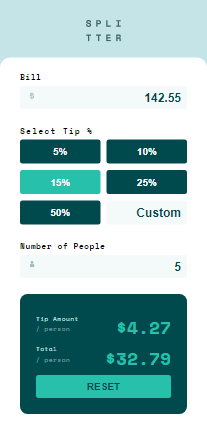
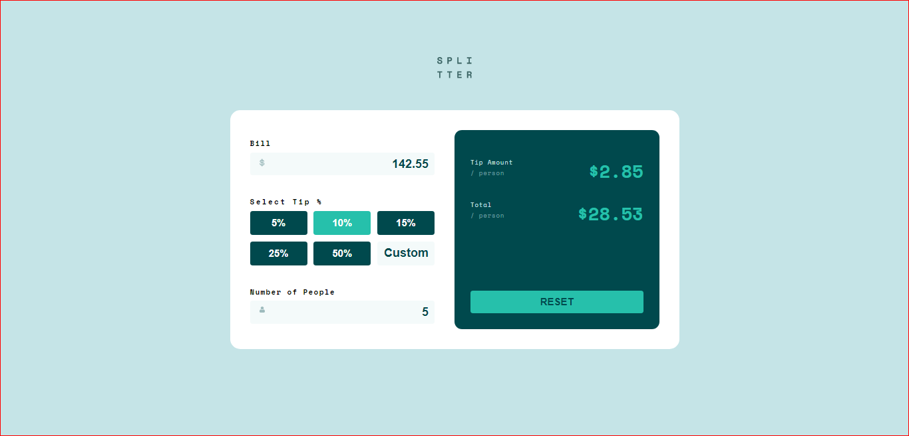

# Frontend Mentor - Tip calculator app solution

This is a solution to the [Tip calculator app challenge on Frontend Mentor](https://www.frontendmentor.io/challenges/tip-calculator-app-ugJNGbJUX). Frontend Mentor challenges help you improve your coding skills by building realistic projects.

## Table of contents

- [Overview](#overview)
  - [The challenge](#the-challenge)
  - [Screenshot](#screenshot)
- [My process](#my-process)
  - [Built with](#built-with)
  - [What I learned](#what-i-learned)
  - [Continued development](#continued-development)
  - [Useful resources](#useful-resources)
- [Author](#author)
- [Acknowledgments](#acknowledgments)

## Overview

### The challenge

Users should be able to:

- View the optimal layout for the app depending on their device's screen size
- See hover states for all interactive elements on the page
- Calculate the correct tip and total cost of the bill per person

### Screenshot




## My process

### Built with

- Semantic HTML5 markup
- CSS custom properties
- Flexbox
- CSS Grid
- Mobile-first workflow
- Vanilla Js
- [Styled Components](https://styled-components.com/) - For styles

### What I learned

Made use of the forEach array method, and it was an amazing learning point for me

```js
tips.forEach((tip) => {
  tip.addEventListener("click", (e) => {
    tips.forEach((tip) => {
      tip.classList.remove("active");
      if (e.target.innerHTML == tip.innerHTML) {
        tip.classList.toggle("active");
        tipValue = parseFloat(tip.innerHTML) / 100;
        calcTip(billValue, tipValue, peopleValue);
      }
    });
  });
});
```

### Continued development

Need to develop more in writing cleaner functions and calling a function inside another function

## Author

- Website - [Ronarexx](https://github.com/Ronarexx)
- Frontend Mentor - [@ronarexx](https://www.frontendmentor.io/profile/Ronarexx)
- Twitter - [@mr_uriri](https://www.twitter.com/Mr_uriri)

## Acknowledgments

special shoutout to my self for not giving up on this project
